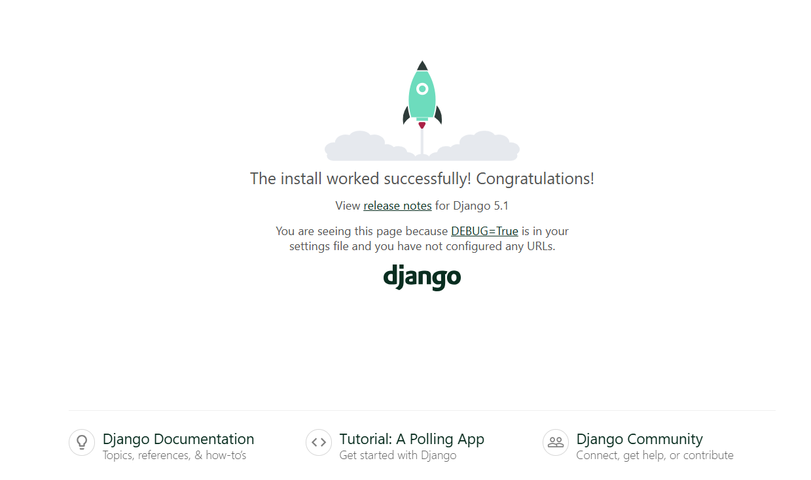

# Django Startup Project Setup


## 1. Set up a Virtual Environment

First, create a virtual environment:
```sh
python -m venv venv
```

Activate the virtual environment:
- On Windows:
  ```sh
  venv\Scripts\activate
  ```

## 2. Install Django

Install Django using pip:
```sh
pip install django
```

Freeze the installed packages into a `requirements.txt` file:
```sh
pip freeze > requirements.txt
```

## 3. Install Dependencies
if we clone the project then its helps to us.

Install the dependencies from the `requirements.txt` file:
```sh
pip install -r requirements.txt
```

## 4. Run the Server

Run the Django development server:
```sh
python manage.py runserver
```

After running this command,  site will be live looks like-



## 5. Update `settings.py`

In `settings.py`, make sure to update the `ALLOWED_HOSTS` variable to include the hosts that should be allowed to access your Django application. For example:
```python
ALLOWED_HOSTS = ['*']  #its means everything
```
or
```python
ALLOWED_HOSTS = ['localhost', '127.0.0.1', 'yourdomain.com'] #specific ip
```

## 6. Create a Django App

Create a new Django app named `home`:
```sh
django-admin startapp home
```
## 7. Add a Model

In the `models.py` file of the `home` app, add the following model:

```python
class TODO(models.Model):
    title = models.CharField(max_length=100)
    description = models.TextField()
```

This `TODO` model includes two fields:
- `title`: A `CharField` with a maximum length of 100 characters.
- `description`: A `TextField` for storing detailed descriptions.

## 8. Database Migrations

Make and apply database migrations:
```sh
python manage.py makemigrations
python manage.py migrate
```
